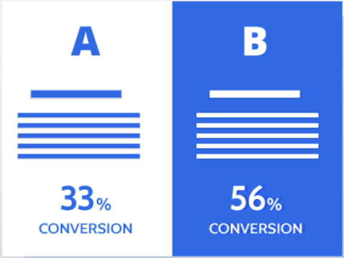
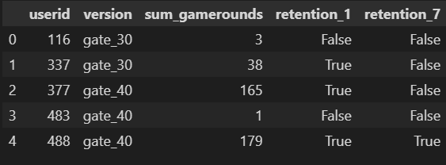
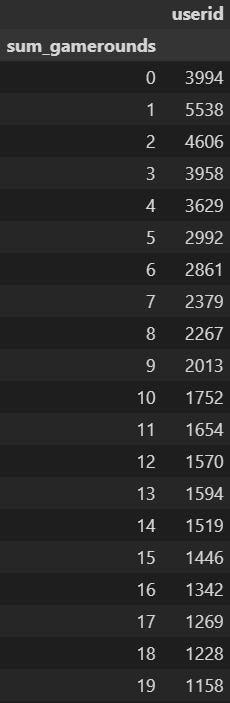
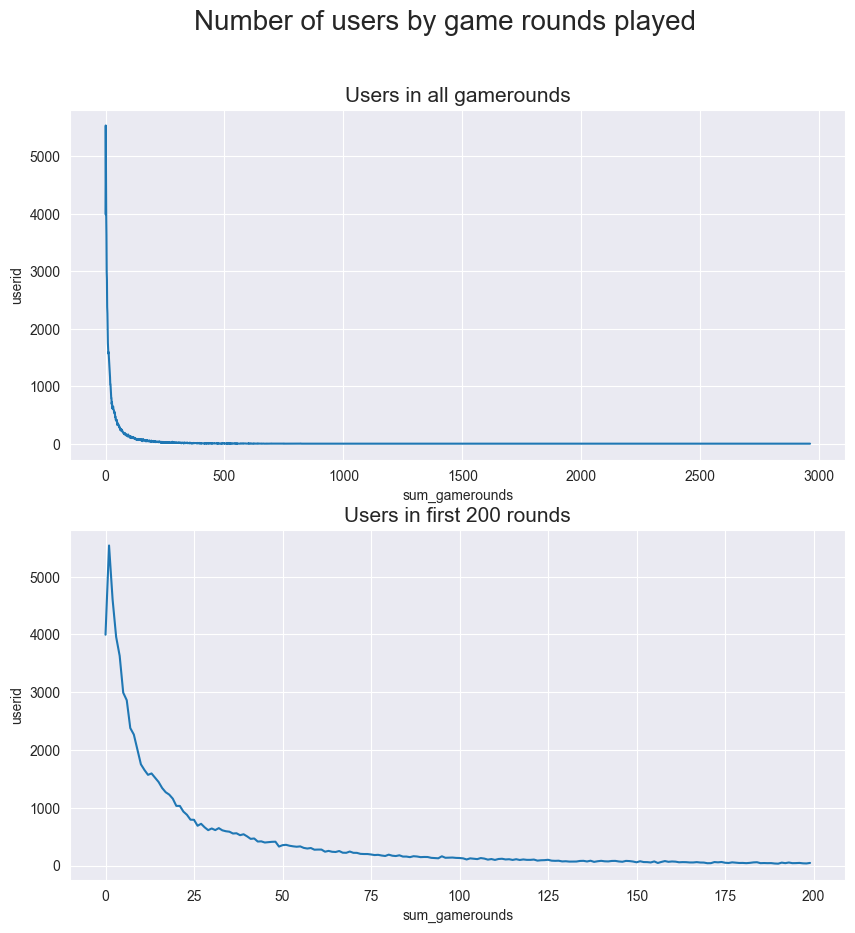
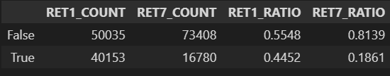
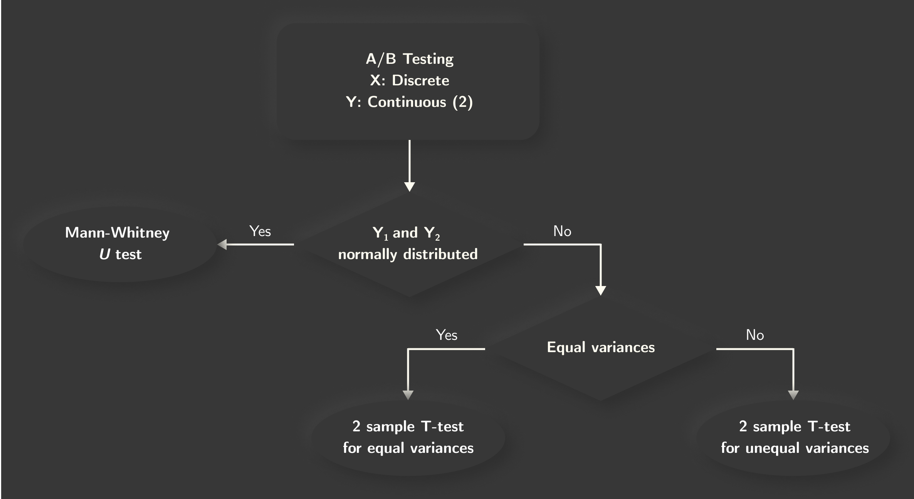
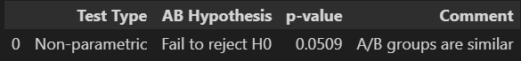
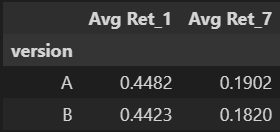

# <!--fit--><SPAN STYLE="text-shadow: 0px 5px 10px #000000">Hypothesis Testing Project</SPAN>

<span style="color:grey">*By*:</span> Siddhant Tripathi
<span style="color:grey">PT-DA 15 Batch</span>

---

# <SPAN STYLE="text-shadow: 0px 5px 10px #000000">Overview</SPAN> 📒
* Objective
* Problem Statement
* Dataset
* Insights
* A/B Testing
* Conclusions

---

# <SPAN STYLE="text-shadow: 0px 5px 10px #000000">Objective</SPAN> 🎯



Compare 2 versions of the same mobile game
* Statistical analysis and summary
* Comment on which version is better 

---

# <SPAN STYLE="text-shadow: 0px 5px 10px #000000">Problem Statement</SPAN> ❔
* Data for mobile game with many levels
* Users encounter gate - make in-app purchase
* Gate at - Version A: Level 30, Version B: Level 40
* Impact on player retention and game rounds

---

# <SPAN STYLE="text-shadow: 0px 5px 10px #000000">Dataset</SPAN> 📑



Features:
Over 90K users
```  
userid - Unique identification number 

version - Player game versions

sum_gamerounds - Number of rounds played

retention_1 - If game played 1 day after installation

retention_7 - If game played 7 days after installation
```
---

# <SPAN STYLE="text-shadow: 0px 5px 10px #000000">Insights</SPAN> 📊



``` python

df.groupby('sum_gamerounds')[['user_id']].count().head(20)

```
Game installed but never played by __*3994 users!*__

---

# <SPAN STYLE="text-shadow: 0px 5px 10px #000000">Insights</SPAN> 📊



``` python

sns.lineplot(data = df.groupby('sum_gamerounds')[['userid']].count(),
 x = 'sum_gamerounds',
 y = 'userid')

```
Number of __*users decrease*__ as rounds progress

---

# <SPAN STYLE="text-shadow: 0px 5px 10px #000000">Insights</SPAN> 📊



``` python

pd.DataFrame({"RET1_COUNT": df["retention_1"].value_counts(),
              "RET7_COUNT": df["retention_7"].value_counts(),
              "RET1_RATIO": df["retention_1"].value_counts() / len(df),
              "RET7_RATIO": df["retention_7"].value_counts() / len(df)})

```
* $55\%$ did not play after day 1
* $81\%$ did not play after day 7

---

# <SPAN STYLE="text-shadow: 0px 5px 10px #000000">A/B Testing</SPAN> 📈


* Check for normality
* Check for homogeneous variances

---

# <SPAN STYLE="text-shadow: 0px 5px 10px #000000">A/B Testing</SPAN> 📈



* Null Hypothesis      
($H_O$): $A = B$
* Alternate Hypothesis 
($H_1$): $A \neq B$
* Confidence level: $95\%$

---

# <SPAN STYLE="text-shadow: 0px 5px 10px #000000">Conclusion</SPAN> ✅



``` python
pd.DataFrame({'Avg Ret_1':df.groupby('version').retention_1.mean(),
              'Avg Ret_7':df.groupby('version').retention_7.mean()})
```

- A/B testing failed to reject null hypothesis
- Version A has better retention than version B

---

# <!--fit--> <SPAN STYLE="text-shadow: 0px 5px 10px #000000">Thank You</SPAN>
<a href="https://github.com/siddhanttripathi13/AB_Testing" target="_blank"></a>


